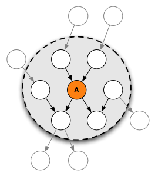

```{r echo = F}
rm(list = ls())
library(dagitty)
library(ggplot2)
library(data.table)
```

This is about learning graph-fu. Wax on, wax off, daniel san.


# Exercise 1: DAG Terminology 

(From Causal Inference in Statistics: A Primer" by Pearl, Glymour, and Jewell, 2016.)

We first define the graph in this exercise using dagitty syntax and plot it.

```{r}
g <- dagitty('dag {
    A [pos="0,0"]
    X [pos="0,1"]
    Y [pos="1,1"]
    Z [pos="2,1"]
    W [pos="1,0"]
    T [pos="2,2"]
    
    A -> X
    X -> Y -> Z -> T
    X -> W -> Y -> T
    W -> Z
}')
plot(g)
```

Use dagitty to extract from graph g: (use `?AncestralRelations` for a list of available commands)


a) Name all of the parents of Z.
b) Name all of the ancestors of Z.
c) Name all of the children of W.
d) Name all of the descendants of W.

Elwert distinguishes between causal and non-causal paths.
A related distinction is between directed and non-directed paths.
Directed paths are paths where all arrows points in the same direction.
A causal path is defined where all arrows point in the direction from treatment to outcome.

e) Use the dagitty function `paths()` to list all paths between X and T.
f) Use the dagitty function `paths()` to list all the directed paths between X and T.

g) Which paths are non-directed paths between X and T? 
h) Is leaving out all paths that contain a collider sufficient to select all directed paths? Answer this for this graph, and in general for all possible DAG's.

## Markov Blanket: (From Wikipedia)

 \


The Markov blanket for a node in a graphical model contains all the variables that shield the node from the rest of the network. This means that the Markov blanket of a node is the only knowledge needed to predict the behavior of that node and its children. The term was coined by Judea Pearl in 1988.

In a causal model, the values of the parents and children of a node evidently give information about that node. However, its children's parents also have to be included, because they can be used to explain away the node in question. The set of all these nodes is called the Markov Blanket.

Every set of nodes in the network is conditionally independent of node A when conditioned on the Markov blanket of node A.
It can be proven that this is also the minimal set of nodes to condition on, to obtain conditional independence of node A from all other nodes.

i) Use the dagitty function `markovBlanket()` to list all variables that are in the Markov blanket of Y.

# Exercise 2: Elementary causal structures

For each of the questions below: simulate a dataset of 10.000 datapoints from the causal model using `rnorm()`. Assume for $U_x$, $U_y$ and $U_z$  normally distributed noise with mean zero and standard deviation 5. Dependence or independence can be empirically verified by scatterplots with a smoother (geom_smooth()) or by calculating a correlation coefficient (for linear dependencies).

a) chain: 

$X = U_{x}$\
$Y = 2 X + U_{y}$\
$Z = 3 Y + U_{z}$


* Plot the DAG using `dagitty`.
* Make a scatterplot of X vs Z.
* Verify that exposure X and outcome Z are independent (uncorrelated) given mediator Y by subsetting the data on a small interval of Y (say 0.8 and 1.2).
* Regress Z on X, as well as Z on X and Y. Compare the estimated coefficients with the causal model.

b) fork: 

$Z = U_{z}$\
$X = -0.5 Z + U_{x}$\
$Y = 2 Z + U_{y}$

Here Z is the common cause of X and Y.

* Plot the DAG using `dagitty`.
* Make a scatterplot of X vs Y.
* Empirically verify that X and Y are independent given Z. Do this by subsetting the data on a small interval of Z.

c) inverted fork (collider): 

$X = U_{x}$\
$Y = U_{y}$\
$Z = 2X - 4Y + U_{z}$

* Plot the DAG using `dagitty`.
* Make a scatterplot of X vs Y.
* Verify that X and Y are dependent given Z after subsetting the data on a small interval of Z. Here Z is a descendant of both X and Y.

# Exercise 3: Playing around with SCM's

(Study question 1.5.1 From Pearl, Glymour and Jewell 2016)

Suppose we have the following SCM (structural casual model). Assume all exogenous variables are independent and
that the expected value of each is 0.

$X = U_{x}$\
$Y = 1/3 X + U_{y}$\
$Z = 1/16 Y + U_{z}$

First, let us generate some data by directly implementing the model specification.

```{r}
N <- 10000 # sample size
Ux <- rnorm( N ); Uy <- rnorm( N ); Uz <- rnorm( N )
X <- Ux
Y <- 1/3*X + Uy
Z <- 1/16*Y + Uz
d <- data.frame(X=X,Y=Y,Z=Z)
```


a) Use `dagitty` to draw the graph that complies with the model.

In R, when a model is fitted with `lm()`, the `predict()` function can be used to predict at specific parameter values.
I.e. `predict(lm(Z ~ X + Y, data = d), list(X = 1, Y = 3), interval = "confidence")`
Compare these results with the parametric functions specified above. Does any of the results surprise you?

In the next few exercises, use the data and the graph to estimate:

b) the best guess of the value (expected value) of Z, given that we observe Y=3.

c) the best guess of the value of Z, given that we observe X=3.

d) the best guess of the value of Z, given that we observe X=1 and Y=3.

e) the best guess of X, given that we observed Y=2.

f) the best guess of Y, given that we observed X=1 and Z=3.


