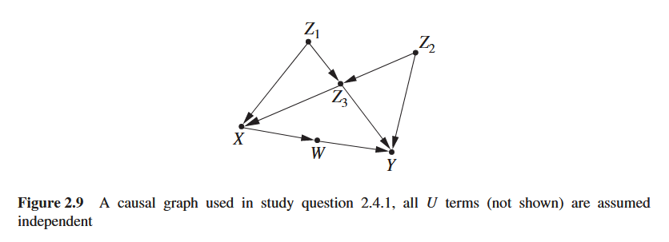

```{r}
library(dagitty)
library(ggplot2)
```

# Exercise 4: D-separation

(adapted from Study question 2.4.1 from Pearl, Glymour and Jewell 2016)

First, visit \url(http://dagitty.net/learn/dsep/index.html) for an interactive tutorial on d-separation.

then: 

Figure 2.9 below represents a causal graph from which the error terms have been deleted.
Assume that all those errors are mutually independent.

{}\

Explore the functionality of the dagitty package for these exercises. 
Check functions `impliedConditionalIndependencies()`, `dseparated()`, `paths()`.

a) Draw the DAG using dagitty. 

b) List all conditional independencies in this graph.

c) List all paths between X and Y. 

d) Which set of variables do we need to condition on, in order to d-separate (block all paths between) this pair of variables? Explain why using the list of all paths between X and Y.

e) List all conditional independencies in this graph, assuming that only variables in the set {Z3,W,X,Z1} can be measured.

Use `latents()`. 

f) For pairs {Z1,  W} and {Z1, Z2}, determine whether they are independent
conditional on all other variables in the graph. (Remember to turn `latents()` off again.)

g) Suppose we wish to estimate the value of Z2 from measurements 
taken on all other variables in the model. Find the smallest set of variables that would yield as good an estimate of Z2
as when we measured all variables.

# Exercise 5: Valid adjustment sets 

In this exercise, we will use various Graphical Identification criteria to identify causal effects in DAGs.

We use the DAG in Figure 13.8 from Elwert.

a) Code the DAG in R using `dagitty`.

b) List all paths between T and Y. which paths are open? 

c) For all open paths between T and Y, which are the causal paths? Which are open backdoor paths?

d) What is the definition of the back-door criterion? Explain why Z = (B) satisfies this criterion.

e) What is the definition of the adjustment criterion? 

f) List all sets of variables that satisfy the "Adjustment criterion" for this DAG.
Use the dagitty function `adjustmentSets()` (Important: by default this function only returns the minimal sufficient adjustment set).

What is the smallest adjustment set for this causal effect?

g) Show that Z = (A, C, D) satisfies the adjustment criterion.

h) What is the definition of the Parents of the treatment criterion? 
Apply the "Parents of the treatment criterion" to identify a valid adjustment set for the causal effect of T on Y.

i) What is the definition of the Parents of the outcome criterion? 
Can the "Parents of the outcome criterion" be applied to this graph?

# Exercise 6: Adjustment sets: estimation and precision

We expect that by adding more predictors that explain variance in the outcome Y, we get a better estimate of the effect of T on Y.

The following code simulates data from the DAG from the previous exercise (Fig 13.8 Elwert)

The structural equations all consist of linear relationships and Gaussian noise for all variables.

```{r}
set.seed(123)
N <- 1000 # sample size
Ua <- rnorm( N ); Ub <- rnorm( N ); Uc <- rnorm( N );
Ud <- rnorm( N ); Ue <- rnorm( N ); Uf <- rnorm( N );
Ut <- rnorm( N ); Uy <- rnorm( N );

A <- Ua
B <- Ub
C <- 3 * A - 2 * B + Uc
D <- 0.5 * B + Ud
T <- -3 * B + Ut
E <- T + 3.5 * D + Ue
F <- 0.8 * T + Uf
Y <- 1.1 * A - 2 * C + 3 * D + 0.4 * E + 0.7 * F + Uy

df <- data.frame(A, B, C, D, T, E, F, Y)
```

a) Derive from the equations what the total causal effect is of T on Y. I.e. how much does the value of Y change if we change T with one unit.

b) Estimate this causal effect from the data using `lm()`, using the *smallest* adjustment set identified in the previous exercise.

c) Estimate this causal effect from the data using `lm()`, using the *largest* adjustment set identified in the previous exercise. 

Compare both estimates, which is more precise (i.e. smallest std errors) and why?

d) Is the largest adjustment set also the set that provides the most precise estimate (i.e. smallest std errors) for the effect of T on Y? Or can you find a better adjustment set?

# Exercise 7: Estimation of causal effects and effect heterogeneity

A paper is published that claims a causal model depicted in Figure 13.7.
The model is used to draw causal inferences from an observational dataset.
The dataset is published as open data with the paper (Awesome!).
You decide to check whether the data is consistent with their causal model.

a) Code the DAG in R.

b) Read in the dataset (fig13.7_data.rds). 

```{r}
df <- readRDS("fig13.7_data.rds")
```

List all implied Independencies, both marginal and conditional. Test these dependencies in the data by making scatterplots with geom_smooth() or using the dagitty function `localTests()`.
Are there any dependencies in the data that are in strong contradiction with the causal model? 
What does this imply for the causal model (DAG)?

c) Use Random forest to model function $C = f_C(B, D, U_C)$ from the data.
This allows non-linearities and interactions in the predictors $B$ and $D$.

You can use the R package `ranger` for this. 

```{r}
library(ranger)
rf.fit <- ranger("C ~ B + D", data = df)
```

d) predict C over the data range of D for both B=-5 and B= +5. Plot both curves in one graph.
Is the causal effect of B on C homogeneous, or does it depend on D?

(Hint: `ranger` has a `predict` method that can work on new data, the predictions are in `predict_output$predictions`)

e) Given a particular value of D, do we have data where B is in the region around -5, as well as data where B is in the region around 5? 

(I.e. For a given counfounder D, do we have overlap of treatment types (value of B) in the data.)

What does this mean for our causal effect estimates of B on C?

