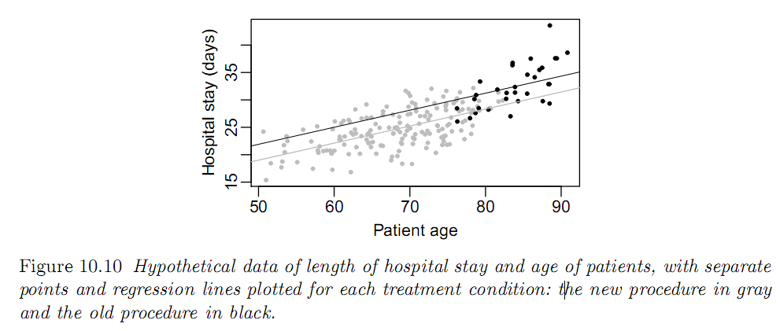

```{r}
library(dagitty)
library(tidyverse)
```

# Causal graph for RDD


# Regression discontinuity analysis: 

suppose you are trying to evaluate the effect of a new procedure for coronary bypass surgery that is supposed to help with the postoperative healing process. 

The new procedure is risky, however, and is rarely performed in patients who are over 80 years old. 

Data from this (hypothetical) example are displayed in Figure 10.10.




(a) Does this seem like an appropriate setting in which to implement a regression
discontinuity analysis?

Based on the description given, the answer is NO, because there is no clear assignment mechanism for treatment.
Although treatment with the new procedure at age above 80 is rarely performed, it IS performed sometimes.
We need to know the decision rule for applying the treatment.

(b) The folder bypass contains data for this example: 

- stay is the length of hospital stay after surgery, 
- age is the age of the patient, 
- and new is the indicator variable indicating that the new surgical procedure was used. 

Preoperative disease severity (severity) was unobserved by the researchers, but we have
access to it for illustrative purposes. Can you find any evidence using these
data that the regression discontinuity design is inappropriate?

```{r}
bypass <- read.csv("bypass.data.csv", sep = "")

bypass <- as.tibble(bypass)

```

```{r}
ggplot(bypass, aes(x = age, y = stay, group = factor(new), colour = factor(new))) + geom_point(aes(size = severity)) +
  geom_smooth()
```

It is clear that severity explains stay as well.

```{r}
ggplot(bypass, aes(x = age, y = severity, group = factor(new), colour = factor(new))) + geom_point(aes(size = stay)) +
  geom_smooth()
```

This looks a bit as if severity-age relationship is different for treated vs untreated.
But maybe not so important.

```{r}
ggplot(bypass %>% filter(age > 76 & age < 83), aes(x = age, y = severity, group = factor(new), colour = factor(new))) + geom_point(aes(size = stay)) +
  geom_smooth()
```


(c) Estimate the treatment effect using a regression discontinuity estimate (ig-
noring) severity. 

```{r}
ggplot(bypass %>% filter(age > 76 & age < 83), aes(x = age, y = stay, group = factor(new), colour = factor(new))) + geom_point(size = 3) +
  geom_smooth()
```

Here the treatment effect appears roughly zero (minus 1 days, but high std err)

```{r}
lmfit <- lm(stay ~ new, data = bypass %>% filter(age > 76 & age < 83))

summary(lmfit)
```


(d) Estimate the treatment effect in any way you like, taking
advantage of the information in severity. 

```{r}
lmfit <- lm(stay ~ age + severity + new, data = bypass)

summary(lmfit)
```

The effect of the new procedure is clearly effective in reducing length of stay.
Effect is minus five days.

This remains if we subset the data on the region of overlap, and ignore age

```{r}
lmfit <- lm(stay ~ severity + new, data = bypass %>% filter(age > 76 & age < 83))

summary(lmfit)
```


(e) Explain the discrepancy between these estimates.

Patients that get the new treatment are more severe, given their age.
Being more severe increases their length of stay. This masks the beneficial effect of the new treatment.

